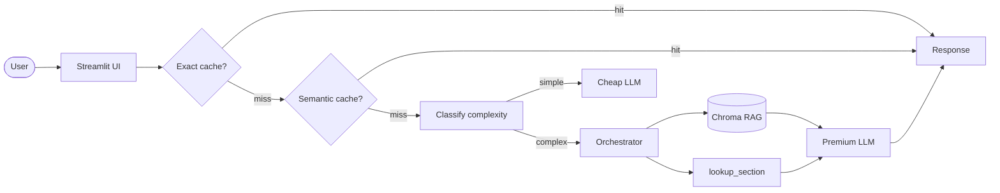

# PPC ES Q&A — Assistente RAG sobre o curso de Engenharia de Software IFSP

> Tire dúvidas sobre o Bacharelado em Engenharia de Software do IFSP São Carlos com respostas baseadas no PPC oficial, com citação de página.

<!-- TODO: cole aqui o GIF de demo (10-15s, <5MB) gerado com peek/terminalizer/OBS -->

**Live demo:** https://rag-portfolio.streamlit.app/

## Problem statement

1. Calouros e alunos têm dificuldade de encontrar informações no PPC de 152 páginas: pré-requisitos, carga horária, regras de TCC, atividades complementares.
2. Para alunos, futuros alunos e coordenação do curso de Engenharia de Software do IFSP São Carlos.
3. RAG é ideal porque o PPC é o corpus canônico; respostas devem citar a página exata para ter credibilidade institucional.

## Corpus

PPC Bacharelado em Engenharia de Software — IFSP Campus São Carlos, atualização de novembro de 2025 (Parecer N.º 37/2025), 152 páginas.

## Arquitetura



## Setup

```bash
# 1. Clone (se nao clonou ainda)
git clone git@github.com:lhjundi/rag-portfolio.git
cd rag-portfolio

# 2. Dependencias
uv venv && source .venv/bin/activate
uv sync

# 3. API key (escolha 1 provider em .env.example)
cp .env.example .env
# edite .env com sua key

# 4. Corpus
# O PPC ja esta versionado em data/corpus/.
# Para trocar, substitua o PDF em data/corpus/ por outro.

# 5. Rodar local
streamlit run src/ui/streamlit_app.py
```

## Cost & Latency

_A preencher após rodar o bench de 50 queries (veja notebook 05)._

| Estrategia | Custo total | Reducao | P95 latency |
|---|---:|---:|---:|
| Baseline (premium sempre) | $X.XX | — | XX ms |
| + Exact cache | $X.XX | XX% | XX ms |
| + Semantic cache | $X.XX | XX% | XX ms |
| **+ Routing cheap-first** | **$X.XX** | **XX%** | **XX ms** |

Meta da rubrica (banda "excelente"): **≥50% de reducao** + P95 reportado.

## Design decisions

- **`chunk_size=800`** — os planos de ensino (seção 18) têm parágrafos densos; um chunk de 800 caracteres mantém uma ementa coesa sem fragmentar demais. **`overlap=100`** preserva a continuidade entre ementa e objetivos quando o corte cai no meio de um bloco.
- **Embedding `gemini-embedding-001`** — melhor custo-benefício para português, idioma principal do corpus.
- **`lookup_section` como tool determinística** — o PPC tem dados estruturados (semestres, códigos, horas) que o LLM tende a confundir; a tool garante precisão ao devolver título, página e descrição fixos por seção, evitando alucinação de números de artigos ou páginas.
- **Routing cheap-first** — perguntas sobre "quais disciplinas" ou "como é estruturado" são complexas e vão para o modelo premium; perguntas diretas como "qual o código de Algoritmos 1?" são simples e vão para o modelo barato.

## Limitations

- O corpus é fixo: apenas o PPC (152 páginas). A demo não suporta upload de outros documentos pelo usuário.
- As páginas usadas pela tool `lookup_section` são aproximadas e mantidas manualmente — se o PPC for reeditado com nova paginação, elas precisam ser atualizadas.
- O free tier do Gemini limita a ~15 RPM, o que torna lento o ingest completo e o bench de muitas queries em sequência.

## Tech stack

- **LLM:** Gemini 2.5 Flash-Lite (default) / GPT-4o-mini (alt)
- **Embeddings:** gemini-embedding-001
- **Vector store:** Chroma local
- **Tool customizada:** `lookup_section(section_key: str)` — navegação dirigida por seção do PPC
- **UI:** Streamlit
- **Observability:** structured logs com trace_id (Langfuse opcional)
- **Deploy:** Streamlit Community Cloud

## Estrutura

```
rag-portfolio/
├── data/
│   ├── corpus/           # PPC do curso (PDF)
│   └── chroma/           # vector store (gitignored)
├── src/
│   ├── ui/streamlit_app.py
│   ├── pipeline/
│   │   ├── rag.py        # ingest_and_index, retrieve, answer
│   │   ├── tools.py      # lookup_section
│   │   ├── cache.py      # ExactCache + SemanticCache
│   │   └── routing.py    # classify_complexity
│   └── observability/trace.py
├── tests/test_smoke.py
├── pyproject.toml
├── .env.example
└── README.md             # voce esta aqui
```

## Componentes (mapa rapido)

| # | Arquivo | Responsabilidade |
|---|---|---|
| **1** | `src/pipeline/rag.py::ingest_and_index` | Lê o PDF, faz chunking e indexa no Chroma |
| **2** | `src/pipeline/rag.py::retrieve` | Busca top-k chunks similares à query |
| **3** | `src/pipeline/rag.py::answer` | Monta contexto, chama o LLM e cita fontes |
| **4** | `src/pipeline/tools.py::lookup_section` | Tool determinística por seção do PPC |
| **5** | `src/pipeline/cache.py::SemanticCache.get` | Cache por similaridade de embedding |
| **6** | `src/pipeline/routing.py::classify_complexity` | Roteamento cheap vs premium |

## Rubrica

Veja `projeto-portfolio.pdf` (briefing do projeto) para a rubrica 3-bandas completa.

| Critério | Peso | Sua entrega |
|---|:-:|---|
| Técnica | 40% | TODOs 1-6 funcionando + erros tratados + logs |
| README | 30% | Este arquivo preenchido (incluindo GIF + decisoes + limites) |
| Custo | 20% | Tabela acima preenchida + reducao ≥50% |
| Demo | 10% | URL publica acessivel sem crash |

---

*Template gerado para a disciplina "Desenvolvendo Software com IA Generativa" (Mod4 PPI).*
